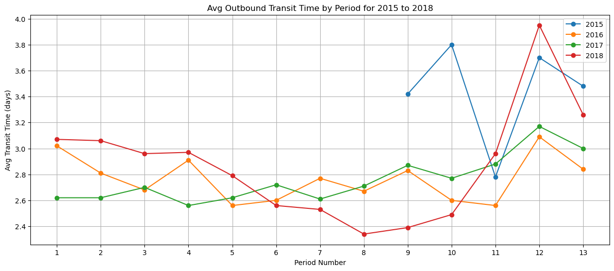
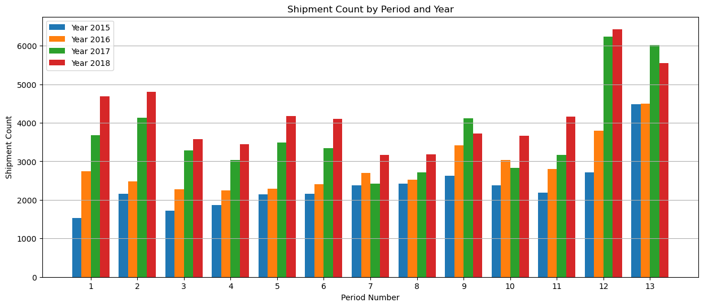

# shipping-data-analysis

# Overview

## Project
Analysis of Outbound Transit Times Post-Carrier Change

This project reviews the impact on transit times after a key logistical change was made in the outbound shipping process. On October 29, 2015 (Period 11), the carrier was switched from USP PRIORITY MAIL to USP FIRST CLASS. The analysis focuses on whether this change significantly affected transit times and identifies any notable trends, spikes, or dips in the transit data from 2015 to 2018.

## Objective
- Assess the impact of switching to USP FIRST CLASS on transit times for outbound shipments.
- Identify any spikes or dips in transit times and analyze trends across different periods and years to gain insights into seasonal and operational variations.

## Data Source
-  [Resources Folder](.resources): CSV files containing details on outbound shipments, carrier costs, and transit times from 2015 to 2018.
-  [Output Folder](.output): CSV files from the inital analysis from the data in the resources folder and paring the data down to focus on the outbound transit times. 

## Technical Skills
Programming Languages:
- Python: Used for data processing, calculations, and visualization.

## Libraries
- Pandas: For data manipulation and cleaning, merging datasets, and calculating transit times.
- NumPy: Used to handle arrays and cumulative counts for stacked bar charts.
- Matplotlib: For visualizing trends in shipment counts and transit times with line and bar charts.

## Data Processing Techniques
- Data Cleaning
- Date Conversion
- Data Merging
- Data Sorting
- Data Visualization

# KEY OBSERVATIONS
- Consistent and Declining Transit Times After Carrier Switch: Following the switch to USP FIRST CLASS at the end of Period 11 in 2015, transit times remained consistently low, averaging between 2.5 and 3 days through Period 13 and beyond. From 2015 to 2018, there was a gradual reduction in average transit times, especially in the first half of each year (Periods 1-6). This trend suggests improvements in operational efficiency over time, possibly due to optimized routes, better carrier management, or other logistical enhancements.

- 2017 Dip in Transit Time: 2017 has the lowest average transit times across most periods. This may be a reflection of specific operational improvements or a temporary increase in efficiency that year. It’s worth investigating what practices or policies were in place in 2017 that contributed to this improvement, as replicating these could provide benefits in other years.

- 2018 Spike in Transit Time: The large spike in transit time in periods 11-13 in 2018 need to be invesitaged further to see what may have caused the issue, such as changes in carrier performance, seasonal demand, or operational delays. Since the carrier switch, this kind of spike had not been observed in prior years. 

- Seasonal Peaks in Transit Time: There are noticeable spikes in average transit time in Periods 10-13. This pattern appears consistently across 2015 to 2018, with each year showing increased transit times in these periods. This trend likely reflects the impact of increased shipment volumes, holiday demand, and potential weather-related delays.

